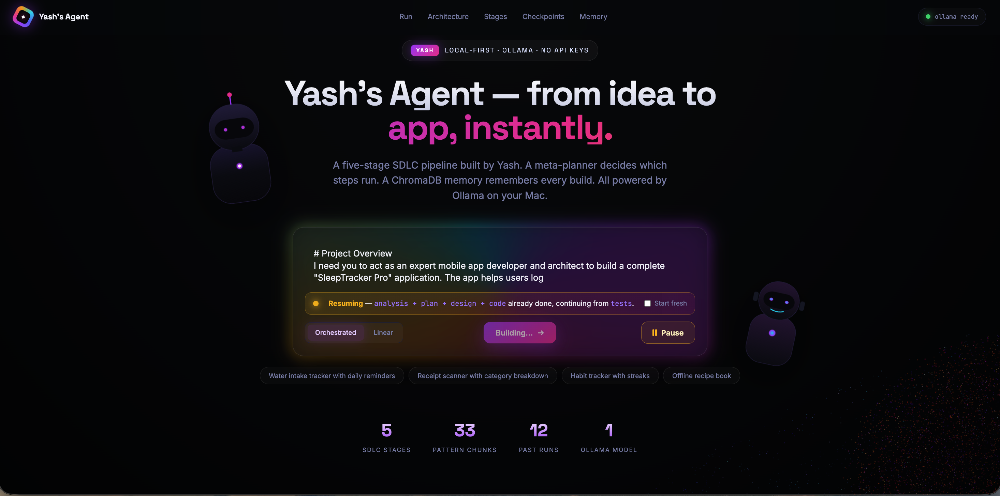
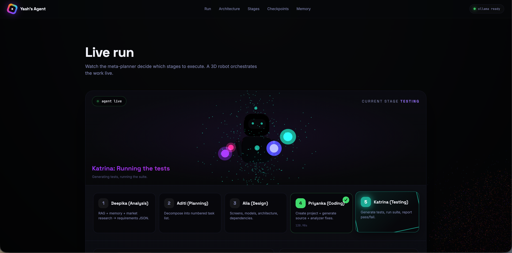
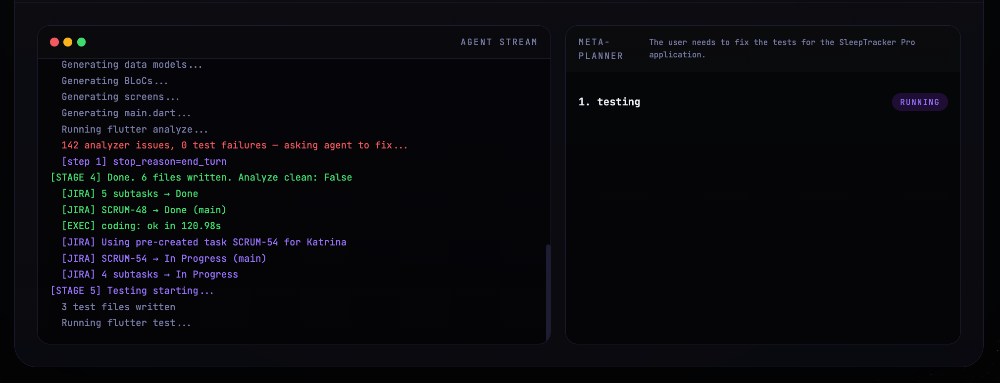
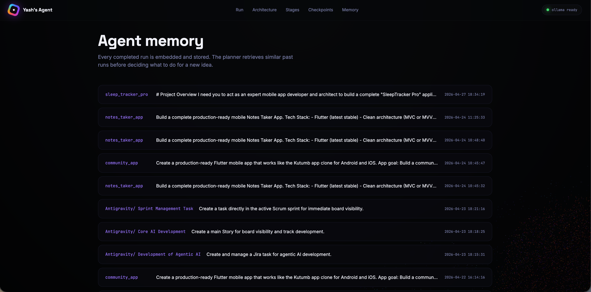
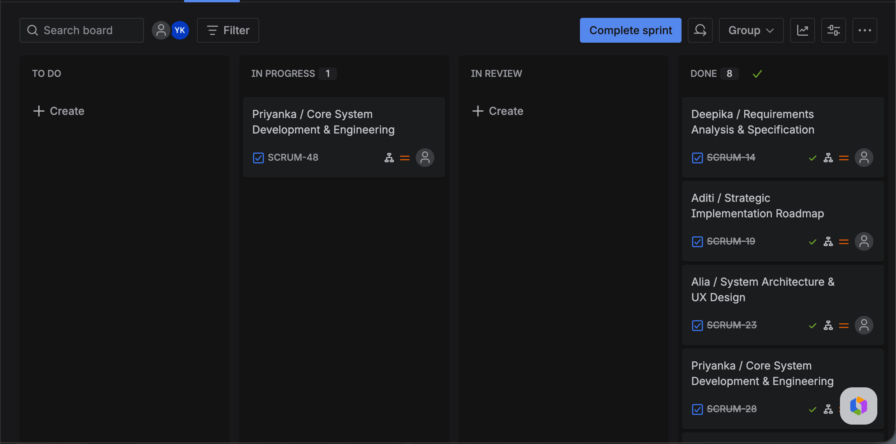

<div align="center">

# Yash's Agent

### Turn an idea into a working Flutter app — locally, without any API keys

A multi-agent SDLC pipeline that runs five role-named AI agents in sequence
(Analysis → Planning → Design → Coding → Testing) to take a one-line app idea
and produce a runnable Flutter project. Powered by Ollama, ChromaDB, and a
meta-planner that decides which stages to run.

[](https://ollama.com)
[](https://flutter.dev)
[](https://www.trychroma.com)
[](https://flask.palletsprojects.com)
[](LICENSE)

[Features](#-features) ·
[Demo](#-demo) ·
[Quick Start](#-quick-start) ·
[Architecture](#-architecture) ·
[API](#-rest-api) ·
[Configuration](#-configuration)

</div>

---

## ✨ Features

|  | Capability |
|---|---|
| 🤖 | **Five named agents** — Deepika · Aditi · Alia · Priyanka · Katrina, each owning one SDLC stage |
| 🧠 | **Meta-planner** decides which stages to run for your specific idea |
| 🔁 | **Rework loop** (up to 5 iterations) — coding ↔ testing until tests pass + analyzer clean |
| 💾 | **Pause / Resume** — full state checkpointed, pick up where you left off |
| 📚 | **RAG memory** — ChromaDB over 20 curated Flutter patterns + every past run |
| 📋 | **Live Jira sync** — main task + subtasks per agent, auto-transitioning To Do → In Progress → Done |
| 🌐 | **Animated 3D UI** — particle-planet hero, real-time stage cards, completion overlay |
| 🔓 | **No API keys** — 100% local LLM via Ollama, optional Jira |
| 🛡️ | **Network retries** — exponential backoff on Ollama hiccups |
| 🔌 | **REST + SSE API** — drive it from any client |

## 🎬 Screenshots

### 1 · Hero — particle planet, glowing prompt, animated agents

The landing page. Saturn-style 3D particle planet behind, two cartoon agents flanking the prompt. Stats band shows live counts of stages, knowledge chunks, past runs, and the active Ollama model. Status pill confirms Ollama is reachable.



> Notice the auto-detected resume banner — when you re-type a previously-paused idea, the agent recognises it and offers to skip already-done stages.

---

### 2 · Live run — meta-planner picks stages, 3D robot orchestrates

After clicking Build, the runtime stage shows a 3D robot with five orbiting agent orbs. The active agent's orb pulses and matches the stage colour. Each card below tracks per-agent status (`Deepika · Aditi · Alia · Priyanka · Katrina`) and shows what they wrote out.



---

### 3 · Agent stream — terminal-style log + meta-planner output

Live SSE stream of every agent, tool call, Jira transition, analyzer issue, and rework loop iteration. Right-hand panel shows the meta-planner's chosen stage list with per-stage status badges.



---

### 4 · Agent memory — every past run, semantic search

ChromaDB-backed vector memory. Every completed run is embedded and stored. The orchestrator queries this on every new idea — similar past projects let it short-circuit planning or reuse design patterns. Click any row to inspect the full state checkpoint.



---

### 5 · Jira board — `agent / task · project` naming, auto-transitions

When Jira sync is enabled, all 5 main tasks + ~19 subtasks pre-create on your sprint board before any agent runs. Tasks transition `To Do → In Progress → Done` automatically as each agent works.



> Toggle Jira off in Settings → pipeline runs identically without a single Jira API call.

---

## 🚀 Installation

### Step 0 — Prerequisites

Install these once on your machine. All are free.

| Tool | Why | macOS install | Linux / Windows |
|---|---|---|---|
| **Python ≥ 3.9** | server runtime | preinstalled or `brew install python` | [python.org](https://www.python.org/downloads/) |
| **Ollama** | local LLM (no API keys) | `brew install ollama` | [ollama.com/download](https://ollama.com/download) |
| **Flutter SDK** | builds the generated app | `brew install --cask flutter` | [flutter.dev/docs/get-started/install](https://flutter.dev/docs/get-started/install) |
| **Git** | cloning | preinstalled | [git-scm.com](https://git-scm.com/downloads) |
| Jira Cloud *(optional)* | task board sync | — | [atlassian.com/jira](https://www.atlassian.com/software/jira/free) |

Verify each:

```bash
python3 --version           # Python 3.9.x or higher
ollama --version            # Ollama 0.x
flutter --version           # Flutter 3.x
git --version
```

---

### Step 1 — Clone the repo

```bash
git clone https://github.com/<your-username>/yashs-agent.git
cd yashs-agent
```

---

### Step 2 — Install Python dependencies

```bash
pip3 install -r sdlc_agent/requirements.txt
```

What gets installed:
- `ollama` — Python client for the local LLM server
- `chromadb` — vector database for RAG
- `flask` — web server + REST API
- `python-dotenv` — `.env` file loader
- `requests` — Jira REST client

---

### Step 3 — Pull the local LLM models

Start Ollama in a background terminal (or as a service):

```bash
ollama serve &
```

Then pull the two required models:

```bash
ollama pull qwen2.5-coder:7b      # ~4.5 GB — chat & code generation
ollama pull nomic-embed-text       # ~275 MB — embeddings for RAG
```

Verify both are installed:

```bash
ollama list
# expect to see qwen2.5-coder:7b and nomic-embed-text
```

> **More RAM, better output.** With 16 GB+ RAM, swap to `qwen2.5-coder:14b` for stronger code generation. Edit `sdlc_agent/config.py`.

---

### Step 4 — Seed the knowledge base

Loads 20 curated Flutter pattern docs into ChromaDB so the agents have engineering context:

```bash
cd sdlc_agent
python3 ingest_patterns.py
```

Expected output:

```
[INGEST] Done. 33 chunks stored. Collection size: 33
```

---

### Step 5 — (Optional) Configure Jira

Skip this step entirely if you don't want Jira board sync. The pipeline works without it.

```bash
cp .env.example .env
```

Edit `.env` and fill in your real Jira credentials:

```env
JIRA_BASE_URL=https://your-workspace.atlassian.net
JIRA_EMAIL=you@example.com
JIRA_API_TOKEN=ATATT3xFfGF0...        # create at id.atlassian.com
JIRA_PROJECT_KEY=SCRUM
```

> **Never commit `.env`** — already gitignored. Use `Settings → Jira` in the UI to enter creds at runtime instead, no file required.

---

### Step 6 — Run the server

From `sdlc_agent/`:

```bash
python3 server.py
```

Look for:

```
[SERVER] Yash's Agent UI starting on http://localhost:5001
```

---

### Step 7 — Open the UI

```bash
open http://localhost:5001       # macOS
# or just paste it into any browser
```

You should see the animated planet hero. Click ⚙ Settings → 🩺 Diagnostics → ▶ Run all checks to confirm every system is green.

---

### Step 8 — Build your first app

1. Type your idea: *"A water-intake tracker with daily reminders"*
2. Optionally configure output directory + Jira via ⚙ Settings
3. Click **Build app ▶**
4. Watch the 3D robot orchestrate all 5 agents
5. When complete: cd into the generated project and run it

```bash
cd ~/Documents/claude\ ai/water_tracker
flutter pub get
flutter run
```

---

### Health check (any time)

```bash
python3 sdlc_agent/check.py
```

Probes: Ollama → models → ChromaDB → Flutter CLI → knowledge base. Anything red points to which step needs fixing.

Or open the UI → ⚙ Settings → 🩺 Diagnostics → click **Run all checks** for the same probe with a nicer view.

---

## 🧠 Architecture

```
              ┌──────────────────────────────────────────────┐
   User idea ─▶│            Meta-Planner (LLM)               │
              │   "Which stages should run for this idea?"   │
              └──────────────┬───────────────────────────────┘
                             ▼
              ┌──────────────────────────────────────────────┐
              │             Meta-Executor                    │
              │   Dispatch stages · Jira transitions ·       │
              │   Checkpoint after each stage                │
              └──────────────┬───────────────────────────────┘
                             ▼
   ┌─────────┬─────────┬─────────┬─────────┬─────────┐
   ▼         ▼         ▼         ▼         ▼         │
 Deepika   Aditi     Alia     Priyanka  Katrina      │
 Analysis  Planning  Design   Coding    Testing      │
                                  │         │         │
                                  ▼         ▼         │
                          ◀── Rework loop (max 5) ────┘
                              if tests fail / analyzer dirty

  ┌────────────────────────────┐    ┌─────────────────────────┐
  │   ChromaDB                 │    │   Ollama (localhost)     │
  │   • appaspect_patterns     │    │   qwen2.5-coder:7b       │
  │   • agent_memory           │    │   nomic-embed-text       │
  └────────────────────────────┘    └─────────────────────────┘
```

### Stage registry

| Agent | Stage | Reads | Writes | Cost |
|---|---|---|---|---|
| **Deepika** | Analysis | `idea` | `analysis` | medium |
| **Aditi** | Planning | `idea`, `analysis` | `plan` | low |
| **Alia** | Design | `idea`, `analysis`, `plan` | `design` | medium |
| **Priyanka** | Coding | `design` | `code`, `project_dir` | high |
| **Katrina** | Testing | `design`, `code` | `tests` | medium |

### State flow

Every stage receives the same `state` dict, reads upstream keys, and writes exactly one new key. Checkpoints save the whole dict after each stage so a paused or crashed run can resume.

```
idea → analysis → plan → design → code → tests
              ↑ checkpoint after each ↑
```

### Two run modes

| Mode | When | Behavior |
|---|---|---|
| **Orchestrated** *(default)* | Real builds | Meta-planner picks stages + rework loop + memory |
| **Linear** | Debugging the pipeline | Fixed 5 stages every time, no meta layer |

---

## 🎛️ Configuration

All knobs live in [`sdlc_agent/config.py`](sdlc_agent/config.py):

```python
MODELS = {
    'analysis':   'qwen2.5-coder:7b',
    'planning':   'qwen2.5-coder:7b',
    'design':     'qwen2.5-coder:7b',
    'coding':     'qwen2.5-coder:7b',
    'testing':    'qwen2.5-coder:7b',
    'embeddings': 'nomic-embed-text',
}
```

**Multi-provider routing**: model names starting with `claude-` route to the Anthropic API (needs `ANTHROPIC_API_KEY`); anything else hits Ollama. Mix-and-match per stage.

### Recommended local models by RAM

| RAM | Coding | Design |
|---|---|---|
| 8 GB | `qwen2.5-coder:7b` | `qwen2.5-coder:7b` |
| 16 GB | `qwen2.5-coder:14b` | `qwen2.5:14b` |
| 24 GB | `qwen3-coder:30b-a3b-q4_K_M` | `qwen2.5:14b` |
| 32 GB+ | `qwen2.5-coder:32b` | `qwen2.5:32b` |

---

## 📡 REST API

Flask server on `localhost:5001`. SSE streaming for live runs.

| Method | Endpoint | Purpose |
|---|---|---|
| `POST` | `/api/run` | Start a run; SSE stream of logs |
| `POST` | `/api/stop` | Pause active run (saves checkpoint) |
| `GET`  | `/api/active` | List currently running pipelines |
| `GET`  | `/api/health` | Ollama + ChromaDB status |
| `GET`  | `/api/stages` | Stage registry |
| `GET`  | `/api/memory` | Past run history |
| `GET`  | `/api/memory/search?q=...` | Semantic search past runs |
| `GET`  | `/api/checkpoints` | List paused / saved runs |
| `GET`  | `/api/checkpoints/<hash>` | Fetch one checkpoint |
| `DELETE` | `/api/checkpoints` | Wipe a checkpoint |
| `GET`  | `/api/jira/transitions/<key>` | Inspect Jira workflow |

### Example — start a run from cURL

```bash
curl -N -X POST http://localhost:5001/api/run \
  -H 'Content-Type: application/json' \
  -d '{"idea":"A habit tracker with streaks","mode":"orchestrated","fresh":false}'
```

The response is a Server-Sent Events stream emitting `start`, `log`, and `done` events.

### Example — pause + resume

```bash
# Pause
curl -X POST http://localhost:5001/api/stop \
  -H 'Content-Type: application/json' \
  -d '{"idea":"A habit tracker with streaks"}'

# Resume — re-send the same /api/run request, omit "fresh" or set false
```

---

## 📁 Project Structure

```
yashs-agent/
├── README.md
├── docs/
│   └── screenshots/                ← drop your screenshots here
└── sdlc_agent/
    ├── server.py                   ← Flask + SSE
    ├── orchestrator.py             ← meta-planner + executor + rework loop
    ├── pipeline.py                 ← linear fallback
    ├── meta_planner.py             ← LLM picks stages
    ├── meta_executor.py            ← dispatch + Jira transitions
    ├── stage_registry.py           ← 5 agents
    ├── stages/
    │   ├── analysis.py             ← Deepika
    │   ├── planning.py             ← Aditi
    │   ├── design.py               ← Alia
    │   ├── coding.py               ← Priyanka
    │   └── testing.py              ← Katrina
    ├── agent.py                    ← shared ReAct loop
    ├── llm.py                      ← Ollama / Anthropic wrapper
    ├── vector_store.py             ← ChromaDB singleton
    ├── state.py                    ← state dict + checkpointing
    ├── config.py                   ← per-stage model selection
    ├── tools/
    │   ├── file_ops.py             ← create_flutter_project, read/write Dart
    │   ├── flutter_cli.py          ← analyze, test
    │   ├── knowledge.py            ← pattern RAG
    │   ├── memory.py               ← run-history RAG
    │   ├── market_research.py      ← Play Store mock reviews
    │   └── jira.py                 ← main + subtask + transitions
    ├── knowledge_base/             ← 20 .md Flutter patterns
    ├── chroma_db/                  ← vector DB (auto-created)
    ├── checkpoints/                ← paused-run state JSONs
    ├── webapp/
    │   └── index.html              ← Three.js UI
    ├── ingest_patterns.py          ← seeds ChromaDB
    ├── check.py                    ← health probe
    └── requirements.txt
```

---

## 🧩 Tech Stack

| Layer | Tool |
|---|---|
| **LLM runtime** | Ollama (local) — qwen2.5-coder:7b for chat, nomic-embed-text for embeddings |
| **Vector DB** | ChromaDB (PersistentClient, two collections) |
| **Backend** | Flask 3 + SSE |
| **Frontend** | Vanilla JS + Three.js (planet-with-rings particle scene) |
| **Generated app** | Flutter 3 / Dart 3 / Material 3 / flutter_bloc / go_router |
| **Task board** | Atlassian Jira REST v3 (optional) |
| **Patterns** | flutter_bloc · Hive · go_router · null safety · Material 3 |

---

## 🧪 Generated apps

The agent produces real, runnable Flutter projects under `~/Documents/claude ai/<app_name>/`:

```bash
cd ~/Documents/claude\ ai/your_app
flutter pub get
flutter run
```

Project layout follows AppAspect conventions: `lib/{models,blocs,screens,repositories}/`, snake_case files, BLoC + go_router + Hive.

---

## 🔥 What makes this different

- **Day 1–5 patterns end-to-end** — ReAct loops, tool design principles, planner+executor, RAG, sequential pipeline — composed into one production-grade system
- **Local-first** — no cloud LLM, no rate limits, no per-token cost
- **Resume-safe** — pause anytime, every stage checkpointed
- **Rework-aware** — coding stage automatically loops with testing failure context until clean
- **Live observability** — Jira board, terminal stream, completion modal, memory tab all reflect live state
- **Multi-provider ready** — flip one line in `config.py` to use Claude or any other model

---

## 🛠️ Troubleshooting

<details>
<summary><b>Ollama not reachable</b></summary>

```bash
ollama serve &
curl -sf http://localhost:11434/api/tags && echo "OK"
```
</details>

<details>
<summary><b>Models missing</b></summary>

```bash
ollama list                      # see what's installed
ollama pull qwen2.5-coder:7b     # for chat
ollama pull nomic-embed-text     # for RAG
```
</details>

<details>
<summary><b>Port 5001 already in use</b></summary>

```bash
lsof -ti :5001 | xargs kill
```
</details>

<details>
<summary><b>Jira tasks not appearing</b></summary>

Check the workflow's transition IDs:

```bash
curl http://localhost:5001/api/jira/transitions/SCRUM-1
```

If your project uses non-standard names like "Working" instead of "In Progress", edit `meta_executor.py` accordingly.
</details>

<details>
<summary><b>Checkpoint resume re-creates everything</b></summary>

Confirm the idea string matches exactly (whitespace counts — checkpoint key is an MD5 hash of the idea). The Run panel's amber resume banner pops when a match is detected; if it doesn't, your idea differs from the saved one.
</details>

---

## 🗺️ Roadmap

- [ ] Web dashboard for memory analytics
- [ ] iOS / Android emulator boot from completion overlay
- [ ] Multi-project workspaces
- [ ] Optional GPT / Claude routing per stage
- [ ] Plugin system for custom agents
- [ ] Streaming Ollama responses in the UI

---

## 🤝 Contributing

PRs welcome. Spawn an issue first for big changes. The codebase follows AppAspect's Day 1–5 training patterns — see knowledge base under `sdlc_agent/knowledge_base/` for conventions.

---

## 📜 License

MIT — do whatever you want, attribution appreciated.

---

<div align="center">

Built with ❤️ by **Yash Koladiya** · [@yashkoladiya](https://github.com/yashkoladiya)

</div>
